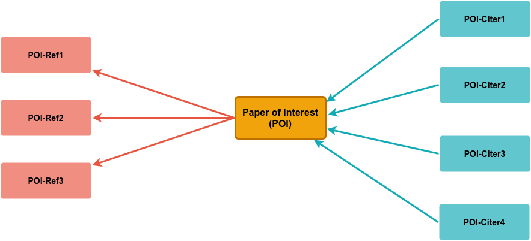
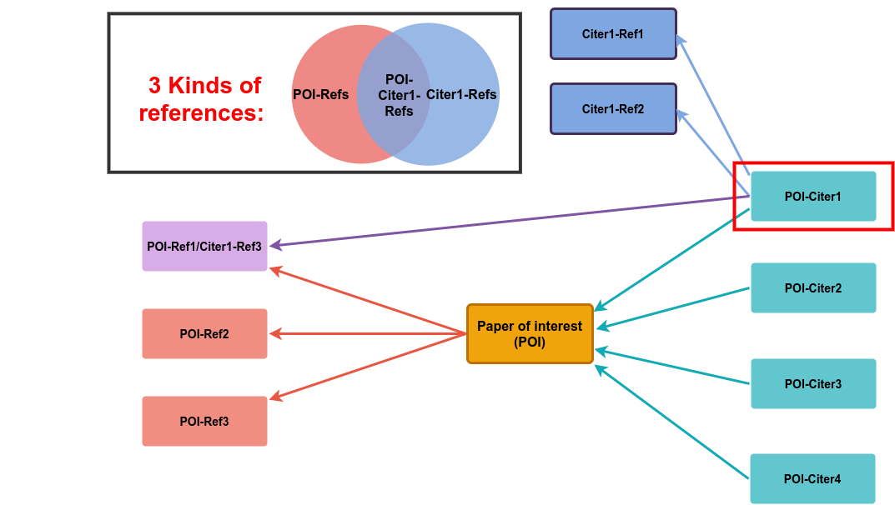
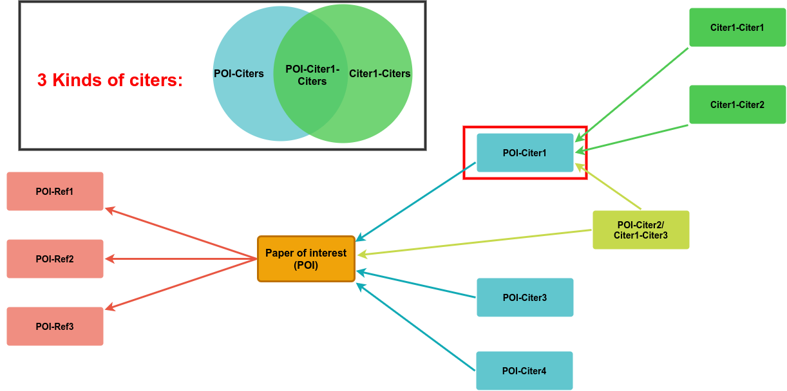

# Analysis of the local citation network
In this repository I explore some ways to analyze citations with a focus on the local citation network.

## Metrics for the overlap of citations between two papers
For example, I'd like to consider the local citation network around a single paper of interest (POI). Such a POI in general has a number of references and a number of citations, I will call the papers that cite the POI, "citers". A small example network could look like this:

If we now additionally consider the references and citers of a second paper, a paper that cited our POI, e.g. POI-Citer1, we can differentiate between different kinds of references and citers. For both a minimal example is shown here:

### 3 kinds of references:

### 3 kinds of citers:

With these differentiations we can ask questions about their ratios, such as "How many references of the POI are also referenced by Citer1?"
